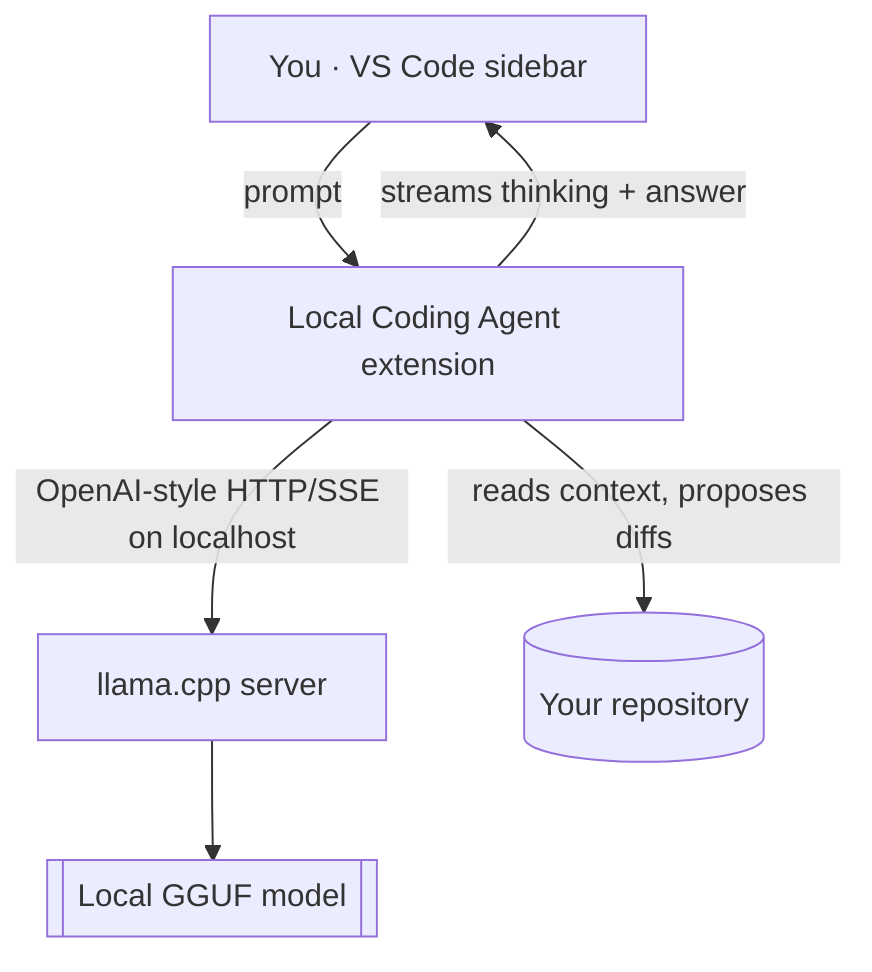

# 🧑‍💻 Local Coding Agent

**A ChatGPT/Copilot‑style coding agent that lives in your VS Code sidebar — but every token of "thinking" runs on your own machine.** No cloud, no API keys, no code leaving your laptop.


It reads your repo, plans, calls tools, proposes and applies edits, runs safe verification commands, watches the results, and keeps going until the task is done — all powered by a local model served through [`llama.cpp`](https://github.com/ggml-org/llama.cpp).

---

## ✨ Highlights

- 🔒 **Fully local & private** — inference stays on `localhost`; remote endpoints are blocked unless you explicitly opt in.
- 🧠 **Live "thinking" view** — watch the model reason in real time with a status card (phase, elapsed timer, token counts) so you always know it's working, not stuck.
- 🛠️ **Real agent, not a chatbot** — inspects files, searches, reads diagnostics & Git history, edits code, and runs tests.
- ✅ **You stay in control** — every edit is a reviewable diff; risky commands need your approval.
- 🔁 **Swappable model** — point it at any OpenAI‑compatible endpoint (any model, any size).
- 🎚️ **Three modes** — Ask (read‑only), Edit (propose changes), Agent (edit + run + verify).

---

## 🖼️ How it works



Nothing in this loop touches the internet (except the one‑time model download).

---

## ✅ Requirements

**To use the extension:** VS Code **1.96+** and a running local model server (below).

**The real constraint is RAM for the model.** The default model (KAT‑Coder‑V2.5‑Dev, `Q5_K_M`, ~23 GB) is tuned for Apple Silicon:

| Your Mac | Default KAT‑Coder (35B) | What to do |
|---|---|---|
| **64 GB** (M‑series) | ✅ Great, full 64K context | Use defaults |
| **32 GB** | ⚠️ Works with a smaller context | Set `contextLength` to `8192`–`16384` |
| **16 GB or less** | ❌ Too big (weights alone > RAM) | **Use a small model instead (below)** |

> 💡 Because the extension only needs *an endpoint*, you can run a small model on modest hardware. **Qwen2.5‑Coder‑7B** (~4.7 GB) runs happily on **8–16 GB**.

You also need **[llama.cpp](https://github.com/ggml-org/llama.cpp)** and **~30 GB free disk** for the default model download (one‑time).

---

## 🚀 Quick start (3 steps)

```bash
git clone https://github.com/madhus1025/LocalModelSetup.git
cd LocalModelSetup
```

### 1️⃣ Start a local model

```bash
brew install llama.cpp        # skip if you already have it
./scripts/start-kat-coder.sh  # keep this terminal open — first run downloads the model
```

> The first launch downloads ~23 GB from Hugging Face. Grab a coffee ☕. Later launches are instant.

**Only 8–16 GB of RAM?** Start a small model instead:

```bash
MODEL_REPO=Qwen/Qwen2.5-Coder-7B-Instruct-GGUF \
MODEL_QUANT=Q4_K_M \
MODEL_ALIAS=qwen2.5-coder-7b \
CONTEXT_SIZE=16384 \
./scripts/start-kat-coder.sh
```

### 2️⃣ Install the extension

**Easiest — one command** (builds and installs it for you):

```bash
./setup.sh
```

**Or install the prebuilt package** (no build tools needed):

```bash
code --install-extension local-coding-agent-0.1.4.vsix
```

### 3️⃣ Chat!

1. **Reload VS Code** → Command Palette (`⇧⌘P`) → **Developer: Reload Window**.
2. Open the **Local Coding Agent** icon in the Activity Bar.
3. If you started a small model, set **`localCodingAgent.model`** to your alias (e.g. `qwen2.5-coder-7b`) in Settings.
4. Ask it something about your repo. 🎉

---

## 🧠 Choose your model

Swap models by changing the environment variables on `./scripts/start-kat-coder.sh`, then match `localCodingAgent.model` to the alias.

| Model | Quant | Size | Good for |
|---|---|---:|---|
| **KAT‑Coder‑V2.5‑Dev** (default) | `Q5_K_M` | ~23 GB | 32–64 GB Macs — strongest coding quality |
| **Qwen2.5‑Coder‑14B** | `Q4_K_M` | ~9 GB | 24–32 GB Macs |
| **Qwen2.5‑Coder‑7B** | `Q4_K_M` | ~4.7 GB | **8–16 GB Macs — best starter** |

Any runtime that speaks OpenAI‑style `GET /v1/models` + streaming `POST /v1/chat/completions` (with `tool_calls` deltas) works.

---

## 🎚️ Modes

| Mode | Can read | Can edit | Can run commands |
|---|:---:|:---:|:---:|
| **Ask** | ✅ | — | — |
| **Edit** | ✅ | ✅ (you review every diff) | — |
| **Agent** | ✅ | ✅ | ✅ (safe ones auto; risky ones need approval) |

---

## 🔒 Privacy & security

- Inference is **loopback‑only** by default; sending context to a non‑local server requires flipping `localCodingAgent.allowRemoteEndpoint` on purpose.
- Every change is an immutable, hash‑bound diff you review before it touches disk.
- Commands are classified: reads/builds/tests can auto‑run; deletion, network, package installs, privilege escalation, and Git state changes need approval. Prefer not to be asked? Hit **Allow all** on a prompt (or enable `localCodingAgent.autoApproveCommands`) to auto‑approve future commands — hard‑blocked ones stay blocked, and you can turn it off in Settings anytime.
- Likely‑secret env vars are stripped and token/key patterns are redacted from command output.
- The audit log records *what happened*, never your prompts, code, or secrets.

See [SECURITY.md](SECURITY.md) for the full threat model.

---

## 🛠️ Troubleshooting

| Symptom | Fix |
|---|---|
| **"Model offline"** in the status bar | Make sure `./scripts/start-kat-coder.sh` is still running, then click the status indicator to re‑check. |
| **Very slow / beachball / crash** | The model is bigger than your RAM. Switch to **Qwen2.5‑Coder‑7B** (see above). |
| **First reply takes a while** | Normal for local models — the live status card shows it's thinking. Big prompts = longer first token. |
| **Nothing happens after install** | Reload the window (Command Palette → *Developer: Reload Window*). |
| **`code` command not found** | In VS Code: Command Palette → *Shell Command: Install 'code' command in PATH*. |

---

## 👩‍💻 Development

```bash
npm install       # install dependencies
npm run compile   # strict type-check + bundle
npm test          # run the test suite
npm run package   # produce a .vsix
```

Press **F5** in VS Code to launch the Extension Development Host with the agent loaded. Architecture, tools, context strategy, and configuration reference live in [docs — see below](#-more).

### 📚 More

- [SECURITY.md](SECURITY.md) — threat model & limitations
- [CHANGELOG.md](CHANGELOG.md) — what changed
- **All settings**: open VS Code Settings and search **“Local Coding Agent”** (endpoint, model, context length, sampling, timeouts, and more).

---

## 📄 License

[MIT](LICENSE) © madhus1025
